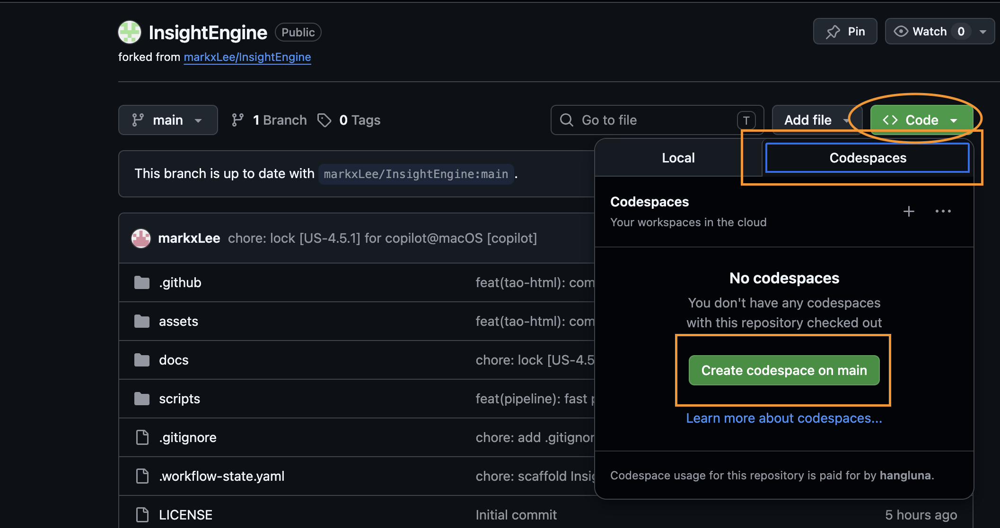

# InsightEngine

Pipeline tổng hợp nội dung đa nguồn → đa định dạng đầu ra, chạy hoàn toàn trong VS Code với GitHub Copilot.

> **🔄 Đã fork repo này?** Bấm **Sync fork → Update branch** trong repo của bạn trên GitHub, sau đó chạy `/cai-dat` để cập nhật.

---

## Getting Started

### Option A — GitHub Codespaces (không cần cài đặt gì, chạy ngay trên trình duyệt)

> **Phù hợp để dùng thử.** GitHub cung cấp [60 giờ Codespaces miễn phí](https://docs.github.com/en/billing/concepts/product-billing/github-codespaces) mỗi tháng. Nhớ **stop codespace sau khi dùng xong** để không vượt quota.

**Bước 1 — Fork repo về tài khoản của bạn**

Vào https://github.com/markxLee/InsightEngine, bấm nút **Fork**:


Điền thông tin fork (giữ nguyên mặc định) rồi bấm **Create fork**:


**Bước 2 — Tạo Codespace**

Trong repo vừa fork, bấm **Code → Codespaces → Create codespace on main**:



Chờ vài phút để Codespace khởi động. VS Code sẽ mở trong trình duyệt.

**Bước 3 — Cài extension GitHub Copilot**

Bấm icon **Extensions** (thanh bên trái), tìm **"copilot"**, chọn **GitHub Copilot** và bấm **Cài đặt**:


Đăng nhập GitHub nếu được hỏi.

**Bước 4 — Dùng InsightEngine**

> ⏱️ **Lần đầu tiên:** Bước `/cai-dat` sẽ cài các thư viện Python/Node.js cần thiết, mất khoảng **2–3 phút**. Chỉ cần làm một lần duy nhất.
>
> ⚡ **Những lần sau:** Start lại codespace là dùng được ngay — không cần cài lại, môi trường đã được lưu.

Mở Copilot Chat (Ctrl+Alt+I hoặc icon chat trên thanh bên), rồi gõ:

```
/cai-dat
```

Sau khi cài xong dependencies, thử ngay:

```
tìm kiếm về xu hướng AI 2025 và tổng hợp thành file Word
```

**Bước 5 — Stop Codespace sau khi dùng xong** ⚠️

Trong repo trên GitHub, bấm **Code → Codespaces**, bấm `...` bên cạnh codespace của bạn và chọn **Stop codespace**:


> Xem chi tiết về quota và billing: https://docs.github.com/en/billing/concepts/product-billing/github-codespaces

---

### Option B — VS Code Local (khuyến nghị nếu dùng thường xuyên)

```bash
git clone https://github.com/<your-username>/InsightEngine
cd InsightEngine
code .
```

Mở Copilot Chat và chạy `/cai-dat` để cài dependencies.

> **Lưu ý:** Image generation (`tao-hinh` với SD-Turbo) chỉ chạy tốt trên Apple Silicon (M1/M2/M3). Các tính năng khác hoạt động trên mọi máy.

---

### Nâng cấp Copilot (tùy chọn)

GitHub Copilot Free có giới hạn request/tháng. Nếu muốn dùng model cao cấp hơn (Claude Sonnet, GPT-4o) và không giới hạn:

👉 https://github.com/settings/copilot/features

---

## 💡 Hướng dẫn sử dụng hiệu quả

### 1. Chỉ cần mô tả những gì bạn muốn — bằng tiếng Việt

InsightEngine tự phân loại yêu cầu và chọn flow phù hợp. Không cần nhớ lệnh hay tên skill.

**Ví dụ:**
```
tìm hiểu về xu hướng AI 2025 và tổng hợp thành file Word
```
```
đọc file input/meeting-notes.docx và tóm tắt thành email
```
```
tạo slide thuyết trình về thị trường fintech Đông Nam Á
```
```
đọc tất cả file trong thư mục input/ và gộp thành một báo cáo duy nhất
```

Pipeline sẽ hiển thị **kế hoạch thực hiện** trước khi chạy — bạn duyệt, điều chỉnh, hoặc bổ sung.

---

### 2. Muốn output dài và chi tiết hơn? Nói rõ trong prompt

Mặc định tạo output ở mức vừa phải (~3,000–5,000 từ). Để nhận tài liệu chuyên sâu:

| Bạn muốn | Từ khóa nên thêm | Kết quả |
|----------|-----------------|---------|
| Tóm tắt nhanh | `"tóm tắt ngắn gọn"`, `"overview"` | ~1,000–2,000 từ |
| Báo cáo đầy đủ | *(mặc định)* | ~3,000–5,000 từ |
| Phân tích chuyên sâu | `"phân tích sâu"`, `"chi tiết"`, `"đầy đủ"` | ~8,000–15,000 từ |

---

### 3. Muốn tìm kiếm toàn diện? Mô tả nhiều chiều

Pipeline tự động kích hoạt **deep research** khi phát hiện yêu cầu phức tạp:
- Có **so sánh** ("so sánh A và B", "phân loại các loại...")
- Trải dài **thời gian** ("từ 2023 đến nay")
- Yêu cầu **đầy đủ** ("tất cả các mô hình", "toàn bộ thị trường")

**Ví dụ:**
```
tổng hợp toàn bộ các mô hình AI lớn từ 2023 đến nay — so sánh benchmark,
nhà phát triển, và ứng dụng thực tế — làm slide dark-modern
```

---

### 4. Chọn style phù hợp

Thêm tên style vào cuối yêu cầu để kiểm soát giao diện slide và HTML:

| Style | Dùng khi nào |
|-------|-------------|
| `corporate` | Báo cáo doanh nghiệp, tài liệu chính thức |
| `academic` | Nghiên cứu, luận văn, hội thảo |
| `minimal` | Tóm tắt nhanh, đơn giản |
| `dark-modern` | Tech talks, startup, công nghệ |
| `creative` | Marketing, sự kiện, workshop |

Nếu không chỉ định, pipeline tự chọn style phù hợp nhất.

---

### 5. Kết hợp nhiều đầu ra

InsightEngine hỗ trợ **output chaining** — tạo nhiều file liên kết nhau:

```
đọc file input/sales_data.xlsx, tạo biểu đồ bar chart và line chart,
rồi nhúng vào báo cáo Word kiểu corporate
```
```
tìm kiếm về AI trends 2025, tạo bảng Excel tổng hợp số liệu,
sau đó dùng số liệu đó làm slide thuyết trình 15 trang
```

---

### 6. Cung cấp file đầu vào

Đặt file cần xử lý vào thư mục `input/`. Hỗ trợ: Word, PDF, Excel, PowerPoint, Text, Markdown, URL, web search.

```
đọc tất cả file trong thư mục input/ và tổng hợp thành một báo cáo duy nhất
```

---

### 7. Kiểm tra chất lượng output

Pipeline tự động chấm điểm output (thang 100 điểm) trước khi giao. Nếu không đạt, tự sửa các phần yếu.

Bạn cũng có thể yêu cầu kiểm tra thủ công:
```
kiểm tra xem output có đúng yêu cầu không
```

---

### 8. Tiếp tục từ lần trước

Nếu pipeline bị gián đoạn (hết context, đổi session), trạng thái được lưu tự động. Chỉ cần nói:
```
tiếp tục
```

Pipeline sẽ tiếp tục từ bước đang dở, không cần bắt đầu lại.

---

## Architecture

```
User Request → dieu-phoi (central orchestrator)
  ├─ Phân loại intent (synthesis / research / creation / design / data)
  ├─ Lên kế hoạch workflow
  ├─ Thu thập dữ liệu (files, URLs, web search)
  ├─ Tổng hợp & biên soạn nội dung
  ├─ Xuất file (Word / Excel / Slide / PDF / HTML / Chart)
  ├─ Kiểm tra chất lượng (100-point audit)
  └─ Giao kết quả
```

## Tech Stack

| Component | Library |
|-----------|---------|
| File reading | markitdown[all] |
| Word output | python-docx |
| Excel output | openpyxl + pandas |
| PPT output | pptxgenjs (Node.js) |
| PDF output | reportlab + pypdf |
| HTML output | jinja2 + inline CSS |
| Charts | matplotlib + seaborn |
| Images | diffusers + torch/MPS (Apple Silicon) |
| Web search | vscode-websearchforcopilot_webSearch |

## License

MIT

